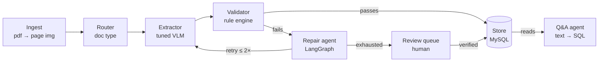
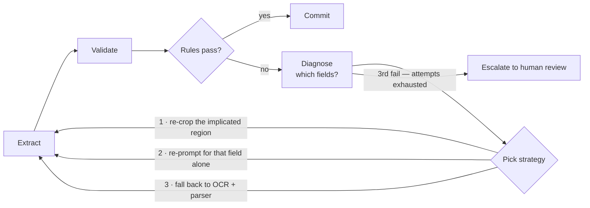

# Attest — Architecture

Version 0.1 — draft · 12 Sept 2026 · Author: Harsh Kumar · Status: pre-implementation

## Contents

1. [Problem & design goals](#1-problem--design-goals)
2. [System architecture](#2-system-architecture)
3. [Component specification](#3-component-specification)
4. [The repair loop](#4-the-repair-loop)
5. [Confidence & escalation](#5-confidence--escalation)
6. [Data model](#6-data-model)
7. [Datasets](#7-datasets)
8. [Evaluation plan](#8-evaluation-plan)
9. [Technology stack](#9-technology-stack)
10. [Repository layout](#10-repository-layout)
11. [Build milestones](#11-build-milestones)
12. [Risks](#12-risks)

---

## 1. Problem & design goals

Extracting structured fields from invoices and receipts is a solved-looking
problem with an unsolved core. A modern vision-language model will return
plausible JSON for almost any document you hand it. The difficulty is that it
returns plausible JSON *whether or not it is correct*, and an accounts-payable
team cannot act on a number that might be hallucinated.

Attest therefore treats extraction as only the first of four stages. The
system's actual output is not a JSON object — it is a JSON object **plus a
defensible claim about which of its fields can be trusted**, and a routed path
for the fields that cannot.

### Design goals

- **Calibrated, not just accurate.** Every extracted field carries a confidence
  score whose stated probability matches its observed correctness rate.
- **Deterministic checks over probabilistic ones.** Arithmetic and cross-field
  consistency are verified by code, not by asking a model to check itself.
- **Recover before escalating.** A failed validation triggers a bounded repair
  attempt before consuming a human's attention.
- **Auditable.** Every field records which component produced it, on which
  attempt, and why it was accepted.
- **Permissively licensed end to end.** No component blocks commercial
  deployment.

### Non-goals

- General-purpose OCR. Attest consumes text and layout; it does not compete on
  raw character recognition.
- Handwriting and severely degraded scans. Out of scope for v1.
- Multi-language support beyond English-language documents in v1.

## 2. System architecture

The pipeline is a directed flow with one cycle. Documents move left to right;
the only backward edge is the repair loop, which returns a failed extraction
to the extractor with narrowed instructions. Work leaves the pipeline through
exactly two exits: the verified store, or the human review queue.



**Figure 1 — End-to-end flow.** The extractor and repair agent are the two
components carrying original work; everything else is conventional plumbing
that exists to make their output trustworthy.

## 3. Component specification

Eight components, each independently testable. The contract between them is a
versioned `ExtractionRecord` — a Pydantic model holding the document
reference, the field set, per-field confidence and provenance, and the
validation report.

### C1 — Ingest

Normalises whatever arrives into page images at a fixed resolution, plus a
text layer where the source is a digital PDF. Rasterises at 200 DPI, deskews,
and caps the long edge so the downstream processor does not blow past the
token budget.

- **in →** PDF, PNG, JPEG
- **out →** page images + optional text layer
- **tech →** pypdfium2, OpenCV

### C2 — Router

Classifies each document into `receipt`, `invoice`, or `unsupported`, and
selects the target schema and prompt accordingly. A small image classifier is
sufficient and is far cheaper than asking the VLM. Documents classified
`unsupported` skip extraction entirely and go straight to review.

- **in →** page images
- **out →** doc type + schema id
- **tech →** fine-tuned ViT or a linear probe on CLIP features

### C3 — Extractor

The core model. A LoRA-adapted Qwen2.5-VL-3B-Instruct that emits the flat
target schema as constrained JSON. Generation is constrained by a grammar so
the output is always parseable — malformed JSON is an engineering failure, not
a model failure. Token log-probabilities are retained for the confidence
estimator.

- **in →** page image + schema prompt
- **out →** JSON fields + token logprobs
- **tech →** Qwen2.5-VL-3B + PEFT/LoRA, served on vLLM with guided decoding

### C4 — Confidence estimator

Converts raw token log-probabilities into a calibrated per-field probability
of correctness. Mean token log-probability across a field's span is the base
signal; a temperature-scaled logistic calibrator fitted on the validation
split maps it to a probability. Reliability is reported as expected
calibration error, not accuracy.

- **in →** field spans + logprobs
- **out →** p(correct) per field
- **tech →** temperature scaling, isotonic regression as fallback

### C5 — Validator

A deterministic rule engine, and the component that catches the errors the
model is confident about. Rules are declared in YAML per schema so new checks
do not require code changes.

- **Arithmetic** — line items sum to subtotal; subtotal + tax − discount = total.
- **Type & format** — dates parse and are not in the future; currency amounts
  have ≤ 2 decimals; invoice numbers match the vendor's known pattern.
- **Cross-field** — due date is on or after issue date; tax rate falls in a
  permitted band.
- **Referential** — vendor resolves against the known-vendor table, fuzzily.

- **in →** ExtractionRecord
- **out →** validation report, per-rule pass/fail with implicated fields
- **tech →** Pydantic + a YAML-declared rule set

### C6 — Repair agent

A LangGraph cyclic graph. On validation failure it diagnoses which fields are
implicated, chooses a repair strategy, re-runs a narrowed extraction, and
re-validates. Bounded at two attempts. Covered in full in
[§4](#4-the-repair-loop).

- **in →** failed record + validation report
- **out →** repaired record, or escalation
- **tech →** LangGraph, Qwen3 via Ollama, tool-calling

### C7 — Review queue

A Gradio interface presenting only the fields that need a human: the page
image with the implicated region highlighted, the model's proposal, and the
failed rule stated in plain language. The reviewer confirms or corrects; the
correction is written back and flagged as gold-standard training data for the
next fine-tuning round.

- **in →** escalated records
- **out →** verified records + new labels
- **tech →** Gradio, FastAPI

### C8 — Query agent

Answers natural-language questions over the verified store — "what did we
spend with this vendor last quarter", "show me every invoice where tax was
flagged". Text-to-SQL against a read-only view that excludes unverified
low-confidence fields, so the agent cannot report an unvalidated number as
fact.

- **in →** natural-language question
- **out →** answer + the SQL it ran
- **tech →** LangGraph, Qwen3-8B, SQLAlchemy

## 4. The repair loop

This is the component that makes the system agentic in a non-decorative
sense. A single-shot extractor either succeeds or fails. Attest instead
observes its own failure, reasons about the cause, selects a corrective
action, and checks whether the action worked — a genuine plan / act / verify
cycle, with a termination condition.



**Figure 2 — The repair cycle.** The backward edge is what separates this from
a pipeline; the attempt counter is what keeps it from running forever.

### Strategy selection

The diagnosis step maps a failed rule to the fields it implicates, then picks
a strategy by failure type rather than at random:

| Failure | Likely cause | Strategy |
|---|---|---|
| Line items don't sum to subtotal | A row was missed or misread | 1 — re-crop the table region and re-extract items only |
| Single field fails format check | Local misread | 2 — targeted re-prompt for that field |
| Field returned empty | Model could not locate it | 3 — OCR fallback + regex over full page text |
| Total inconsistent, items correct | Total itself misread | 1 — re-crop the totals block |

> **The ablation that sells the project.** Run the full evaluation with the
> repair loop disabled, then enabled. The delta in end-to-end document
> accuracy and in escalation rate is the single most persuasive number in the
> repository — it is direct evidence that the agentic layer does work rather
> than decorating a model call.

## 5. Confidence & escalation

Confidence is only useful if it is calibrated. A model that says "90% sure"
should be right about 90% of the time; measuring this is what turns a score
into a decision threshold.

### Escalation policy

| Condition | Disposition | Route |
|---|---|---|
| All rules pass, all fields ≥ τ | auto-commit | Store, verified |
| All rules pass, some field < τ | field review | Queue — only the low-confidence fields shown |
| Rule failure, repair succeeded | spot check | Store, flagged for sampling audit |
| Rule failure, repair exhausted | full review | Queue — whole document |
| Router says unsupported | full review | Queue, extraction skipped |

The threshold τ is not a constant chosen by taste. It is selected from the
precision–coverage curve on the validation split by fixing the target field
precision — say 99% — and reading off the automation rate that policy buys.
**That trade-off curve is the headline chart of the README.**

## 6. Data model

MySQL 8, with JSON columns for the raw payloads and generated columns for the
fields queried often enough to deserve an index. Four tables carry the
system.

```sql
-- one row per ingested document
CREATE TABLE documents (
  id              BIGINT PRIMARY KEY AUTO_INCREMENT,
  source_hash     CHAR(64) NOT NULL UNIQUE,   -- dedupe identical uploads
  doc_type        ENUM('receipt','invoice','unsupported'),
  page_count      SMALLINT,
  storage_uri     VARCHAR(512),
  ingested_at     DATETIME DEFAULT CURRENT_TIMESTAMP
);

-- one row per extraction attempt; history is never overwritten
CREATE TABLE extractions (
  id              BIGINT PRIMARY KEY AUTO_INCREMENT,
  document_id     BIGINT NOT NULL,
  attempt         TINYINT NOT NULL,           -- 0 = first pass, 1..2 = repairs
  strategy        VARCHAR(32),                -- null on attempt 0
  model_version   VARCHAR(64) NOT NULL,
  payload         JSON NOT NULL,              -- the extracted field set
  confidences     JSON NOT NULL,              -- field -> calibrated p(correct)
  validation      JSON NOT NULL,              -- per-rule outcome
  status          ENUM('auto','repaired','escalated','verified') NOT NULL,
  latency_ms      INT,
  created_at      DATETIME DEFAULT CURRENT_TIMESTAMP,
  total_amount    DECIMAL(14,2)
      AS (CAST(JSON_UNQUOTE(JSON_EXTRACT(payload,'$.total')) AS DECIMAL(14,2))) STORED,
  vendor_name     VARCHAR(255)
      AS (JSON_UNQUOTE(JSON_EXTRACT(payload,'$.vendor_name'))) STORED,
  FOREIGN KEY (document_id) REFERENCES documents(id),
  INDEX idx_vendor (vendor_name),
  INDEX idx_status_created (status, created_at)
);

-- human corrections; the gold set for the next training round
CREATE TABLE reviews (
  id              BIGINT PRIMARY KEY AUTO_INCREMENT,
  extraction_id   BIGINT NOT NULL,
  field_path      VARCHAR(128) NOT NULL,
  model_value     TEXT,
  corrected_value TEXT,
  was_correct     BOOLEAN NOT NULL,           -- feeds calibration measurement
  reviewer        VARCHAR(64),
  reviewed_at     DATETIME DEFAULT CURRENT_TIMESTAMP,
  FOREIGN KEY (extraction_id) REFERENCES extractions(id)
);

-- referential validation target
CREATE TABLE vendors (
  id              BIGINT PRIMARY KEY AUTO_INCREMENT,
  canonical_name  VARCHAR(255) NOT NULL,
  tax_id          VARCHAR(64),
  invoice_pattern VARCHAR(128)                -- regex for this vendor's numbering
);
```

Two properties matter here and are worth stating in the README. **Attempts
are append-only** — the repair history is preserved, which is what makes the
audit trail real rather than claimed. And **`reviews.was_correct` closes the
loop**: it is simultaneously the correction, the calibration measurement, and
the next round's training label.

## 7. Datasets

| Dataset | Contents | Role | Access |
|---|---|---|---|
| **CORD-v2** | 1,000 Indonesian receipts, nested JSON ground truth | Primary training & development set | HF · naver-clova-ix/cord-v2 |
| **DocILE** | Real business invoices, ~6.7k annotated + large unlabelled pool | Generalisation test — different domain, harder layouts | docile.rossum.ai · registration |
| **SROIE** | Scanned receipts, 4 key fields | Third-party eval set, never trained on | HF / ICDAR 2019 |
| **FUNSD** | 199 noisy scanned forms | Stress test for the router and degraded input | HF · nielsr/funsd |

Train on CORD-v2 only. Report on all four. Holding SROIE and FUNSD completely
out of training is what lets you claim generalisation rather than
memorisation — and a candidate who can explain why that separation matters is
already ahead of most.

## 8. Evaluation plan

Three baselines, evaluated identically, so every claim in the README is a
comparison rather than an absolute.

- **B0 — OCR + rules.** Tesseract or PaddleOCR plus regex. The honest floor,
  and often better than people expect.
- **B1 — Zero-shot VLM.** Qwen2.5-VL-3B, no fine-tuning, same prompt. Isolates
  what the fine-tune contributed.
- **B2 — Fine-tuned VLM, no agent.** Single shot, no validation or repair.
  Isolates what the agentic layer contributed.
- **Attest — full system.** Fine-tuned extractor + validator + repair loop.

### Metrics

| Metric | Definition | Why it is here |
|---|---|---|
| Field-level F1 | Per field type, exact-match after normalisation | The standard comparable number |
| Document accuracy | Share of documents with every field correct | What an AP team actually cares about |
| Expected calibration error | Gap between stated confidence and observed correctness | Proves the confidence scores mean something |
| Automation rate @ 99% precision | Share auto-processed at a fixed precision target | The business framing of the whole system |
| Escalation rate | Share of documents reaching a human | Repair-loop effectiveness, directly |
| Latency p50 / p95 | Per document, end to end | Shows engineering, not just modelling |

Normalisation before comparison is doing real work here and should be
documented: currency symbols stripped, whitespace collapsed, dates to ISO
8601, amounts to two decimals. Report whether a match is exact or normalised,
because inflating scores through generous normalisation is the most common
way these numbers get quietly gamed.

## 9. Technology stack

| Layer | Choice | Licence | Rationale |
|---|---|---|---|
| Extractor | Qwen2.5-VL-3B-Instruct + LoRA | Apache-2.0 | Fits QLoRA on a 16 GB T4; permissive licence |
| OCR fallback | PaddleOCR-VL (0.9B) | Apache-2.0 | ~2 GB VRAM, strong on structured documents |
| Agent LLM | Qwen3 (4B dev / 8B eval) | Apache-2.0 | Tool-calling; 4B runs locally on 6 GB |
| Orchestration | LangGraph | MIT | Cyclic graphs with explicit state — matches the repair loop exactly |
| Serving | vLLM + FastAPI | Apache-2.0 | Guided decoding for schema-constrained JSON |
| Store | MySQL 8 | GPL / dual | Native JSON, `JSON_TABLE`, generated columns |
| UI | Gradio | Apache-2.0 | Fastest path to a reviewable demo |
| Training | PEFT, TRL, bitsandbytes | Apache-2.0 | Standard QLoRA stack |
| Tracking | Weights & Biases | free tier | Public run links in the README are strong evidence |

**Deliberately excluded:** LayoutLMv3, despite being the obvious choice. Its
weights are released under CC BY-NC-SA 4.0 — non-commercial — which undercuts
the claim that this system is deployable. Say so in the README; noticing a
licence constraint is a signal in itself.

## 10. Repository layout

```
attest/
├── README.md              ← architecture diagram, results table, demo GIF
├── docker-compose.yml     ← api + mysql + ollama, one command up
├── src/attest/
│   ├── ingest/            C1 — rasterise, deskew, normalise
│   ├── router/            C2 — document type classifier
│   ├── extract/           C3 — model wrapper, prompts, guided decoding
│   ├── confidence/        C4 — logprob aggregation + calibrator
│   ├── validate/
│   │   ├── engine.py
│   │   └── rules/         receipt.yaml, invoice.yaml
│   ├── agent/
│   │   ├── graph.py       C6 — LangGraph repair cycle
│   │   └── strategies.py
│   ├── store/             models, migrations, queries
│   ├── query/             C8 — text-to-SQL agent
│   └── api/               FastAPI routes
├── training/
│   ├── prepare_cord.py    CORD JSON → flat target schema
│   ├── train_lora.py
│   └── calibrate.py
├── eval/
│   ├── run_benchmark.py   all four systems, all four datasets
│   ├── metrics.py
│   └── results/           committed CSVs + generated charts
├── ui/                     C7 — Gradio review queue
├── tests/
└── notebooks/              exploration only, never the source of truth
```

Keeping `eval/results/` in version control matters more than it looks. A
reviewer can see the numbers without running anything, and the commit history
shows them improving — which reads as a research process rather than a single
lucky run.

## 11. Build milestones

Five weeks, each ending in a gate that must hold before the next begins. The
ordering is deliberate: the evaluation harness is built *before* the model, so
there is never a point where progress cannot be measured.

**Week 1 — Data & measurement.** Load CORD-v2, define and freeze the flat
target schema, build the evaluation harness and the normalisation rules, and
run baselines B0 and B1.
Gate → baseline numbers exist and are reproducible from a single command.

**Week 2 — The extractor.** QLoRA fine-tune on Kaggle, add guided decoding,
evaluate as B2, and run the generalisation test on DocILE and SROIE.
Gate → B2 beats B1 on field F1, with the margin quantified.

**Week 3 — Trust layer.** Extract per-field log-probabilities, fit the
calibrator, measure calibration error, author the YAML rule sets, and produce
the precision–coverage curve.
Gate → calibration error under 0.05; τ chosen from the curve, not by taste.

**Week 4 — The agent.** Build the LangGraph repair cycle and the three
strategies, wire MySQL persistence, and run the with/without-repair ablation.
Gate → escalation rate measurably lower with the loop enabled.

**Week 5 — Ship it.** FastAPI service, Gradio review queue, query agent,
Docker Compose, tests, README with the results table and architecture
diagram, and a two-minute demo recording.
Gate → a stranger can clone, `docker compose up`, and process a document.

## 12. Risks

| Risk | Signal | Mitigation |
|---|---|---|
| Fine-tune exceeds 16 GB VRAM | OOM during training | Cap image long edge, gradient checkpointing, batch size 1 with accumulation; drop to 2B if forced |
| CORD is too easy — ceiling effect | Baseline B1 already near 0.95 F1 | Shift the headline claim to DocILE, where layouts are genuinely harder |
| Log-probs are poorly calibrated | Calibration error stays high after temperature scaling | Isotonic regression; or self-consistency sampling as an alternative confidence signal |
| Repair loop shows no gain | Ablation delta near zero | Report it honestly — a negative result with a diagnosis reads better than a hidden one. Then check whether the validator is catching too little. |
| Scope creep into contracts | Week 3 and nothing shipped | Contracts are v2. Ship receipts and invoices first. |
